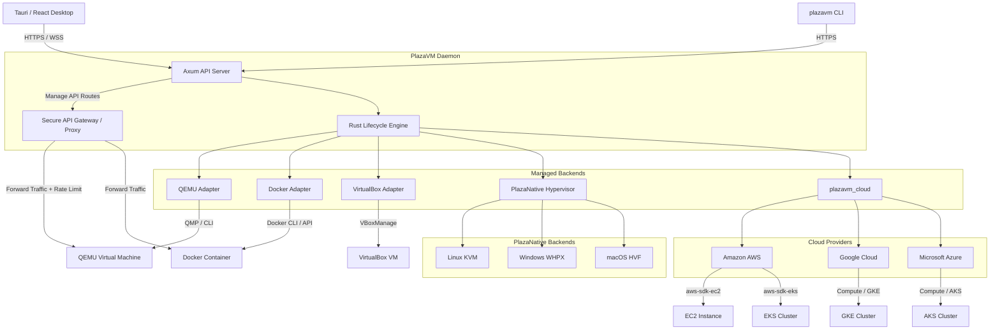

# PlazaVM

PlazaVM is a cross-platform workload control plane for virtual machines, OCI containers, host workloads, and—incrementally—cloud and infrastructure providers. It combines a Rust lifecycle engine and API server with a Tauri/React desktop client.

PlazaVM is under active development. QEMU, Docker, and VirtualBox are the first managed execution backends. PlazaNative is experimental. Cloud provider screens and several advanced topology features are not production-ready; the project reports those limitations rather than returning fake success.

## Current capabilities

- Create and provision QEMU disks with `qemu-img`.
- Start QEMU guests with CPU, memory, firmware, disk, ISO, network, audio, USB, and SDL/VNC/SPICE/headless display configuration.
- Control QEMU through a local QMP channel: shutdown, force-stop, pause, resume, and snapshots.
- Create, start, stop, kill, pause, and resume Docker containers with resource limits and PlazaVM ownership labels.
- Create and register VirtualBox guests, VDI disks, ISO attachments, networking, GUI/headless/VRDE display, lifecycle operations, and snapshots.
- Discover and operate existing Docker, Hyper-V, WSL, VirtualBox, VMware, and Windows service workloads where the host tools are installed.
- **Secure API Gateway**: Automatically tunnel and reverse-proxy external traffic (`/gw/*path`) directly to internal Virtual Machines, Containers, and Cloud Instances, protected by API Keys and Rate Limiting.
- **Cross-Platform Native Hypervisor (`plazavm_hyper`)**: Experimental direct integrations for Windows (WHPX), Linux (KVM), and macOS (Hypervisor.framework).
- **Multi-Cloud Provisioning (AWS, GCP, Azure)**: Native integrations to spin up and control virtual machines across major cloud providers via `plazavm_cloud`.
- **Managed Kubernetes Cluster Deployment**: Treat entire managed clusters (EKS, GKE, AKS) as workloads alongside local VMs, controlling their lifecycles seamlessly.
- Query runtime availability through `GET /api/v1/system/capabilities`.
- Use the same lifecycle API from the desktop client and CLI.

See [the support matrix](docs/support-matrix.md) for exact status and limitations.

## Architecture



External runtimes are integrated through their supported control interfaces. Their source code is not copied into PlazaVM. This keeps licensing boundaries clear and lets operators patch or upgrade the runtime independently.

Detailed design: [docs/architecture.md](docs/architecture.md).

## Prerequisites

Required for all builds:

- Rust stable and Cargo
- Node.js 20+ and npm for the desktop frontend

Install at least one execution backend:

- QEMU and `qemu-img` for managed VMs
- Docker Engine or Docker Desktop for OCI containers
- Oracle VirtualBox for the VirtualBox backend

Hardware acceleration depends on the host:

- Windows: WHPX or Hyper-V
- Linux: KVM and access to `/dev/kvm`
- macOS: Hypervisor.framework
- Other hosts: QEMU TCG software emulation

## Build

```powershell
cargo build --workspace
cd crates/plazavm_desktop
npm install
npm run build
```

Run the API/CLI daemon:

```powershell
cargo run -p plazavm_cli -- server --port 8080
```

Run the desktop application:

```powershell
cd crates/plazavm_desktop
npm run tauri dev
```

Inspect detected runtimes after starting the daemon:

```powershell
curl -k -H "Authorization: Bearer $env:PLAZAVM_TOKEN" https://127.0.0.1:8080/api/v1/system/capabilities
```

## Runtime configuration

- `PLAZAVM_CONTAINER_RUNTIME`: Docker-compatible CLI path.
- `PLAZAVM_VBOXMANAGE`: explicit `VBoxManage` path.
- `PLAZAVM_API_TOKEN`: daemon bearer token.
- `PLAZAVM_HOST` and `PLAZAVM_TOKEN`: CLI connection settings.

VM state is stored under `~/.plazavm`. Runtime logs are written inside each managed VM directory.

## Project structure

```text
crates/
  plazavm_core/        lifecycle, configuration, QEMU and VirtualBox adapters
  plazavm_cloud/       multi-cloud abstraction (AWS, GCP, Azure, VM & K8s clusters)
  plazavm_container/   OCI/Docker container adapter
  plazavm_hyper/       experimental PlazaNative hypervisor
  plazavm_disk/        disk format readers and writers
  plazavm_server/      authenticated HTTPS/REST/WebSocket API
  plazavm_cli/         command-line client and daemon entry point
  plazavm_desktop/     Tauri + React desktop application
  plazavm_automation/  workflow persistence and execution
  plazavm_plugin/      plugin contracts and discovery
  plazavm_fs/          experimental Plaza disk filesystem
protos/                gRPC contracts
runtimes/              auxiliary runtime experiments
docs/                  architecture, support status, API, roadmap
archive/               previous TypeScript implementation
```

## Development policy

- Never report a lifecycle operation as successful unless the backend confirms it.
- Keep backend-specific behavior behind adapter contracts.
- Do not commit certificates, private keys, generated binaries, VM disks, or runtime state.
- Add contract tests for command construction and integration tests gated on runtime availability.
- Treat externally supplied disk paths, images, credentials, and extra arguments as untrusted input.

The staged roadmap is maintained in [docs/development-roadmap.md](docs/development-roadmap.md).
