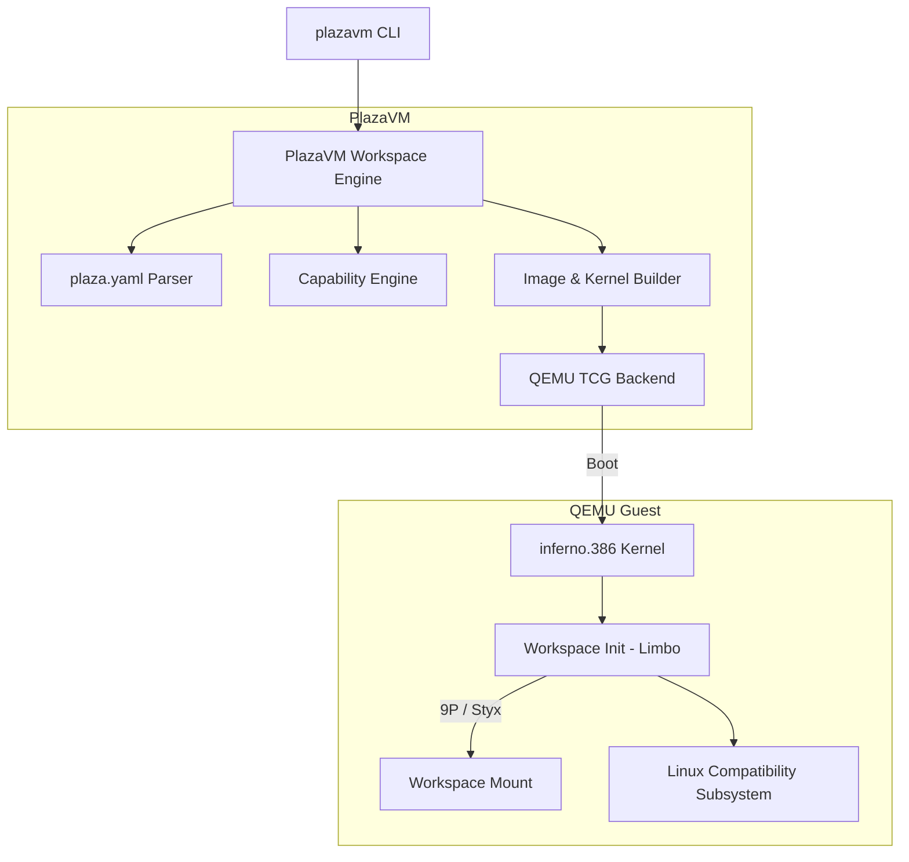

# PlazaVM

PlazaVM is a lightweight, secure, and portable virtual workspace control plane designed to provide isolated and reproducible development environments.

PlazaVM uses **Inferno OS** as its workspace environment and **QEMU** as the virtualization layer. Rather than relying on conventional container runtimes, PlazaVM follows a VM-oriented architecture that emphasizes isolation, portability, deterministic environments, and a minimal runtime footprint.

The project is under active development, with ongoing work across workspace lifecycle management, capability control, filesystem integration, and compatibility features.

## Core Capabilities

* **Inferno OS–based Architecture**
  Workspace environments are built around customized `inferno.386` kernels and the Inferno runtime.

* **Minimal Runtime Requirements**
  PlazaVM does not depend on Docker, Podman, or another container runtime for workspace execution. QEMU provides the virtualization layer required to launch the workspace environment.

* **Fast Workspace Startup**
  The system is designed for rapid boot and initialization of an interactive Limbo/Dis environment.

* **9P / Styx Workspace Integration**
  Host-to-guest filesystem access is provided through Inferno's Styx protocol. Workspace resources can be exposed through supported virtio-serial or network-based communication channels.

* **Declarative Capability Control**
  Workspace capabilities such as networking and host filesystem access are disabled by default and can be explicitly declared through PlazaVM's capability configuration.

* **Linux Compatibility Layer — Work in Progress**
  PlazaVM includes an experimental Limbo-based compatibility subsystem intended to support a subset of Linux system interfaces and enable selected static ELF binaries to operate within the Inferno environment.

See the [support matrix](docs/support-matrix.md) for the current implementation status, supported features, and known limitations.

## Architecture


```mermaid
graph TD
    CLI[plazavm CLI] --> Engine[PlazaVM Workspace Engine]

    subgraph PlazaVM
        Engine --> Config[plaza.yaml Parser]
        Engine --> Capability[Capability Engine]
        Engine --> Image[Image & Kernel Builder]
        Image --> QEMU[QEMU TCG Backend]
    end

    subgraph QEMU Guest
        QEMU --> |Boot| Inferno[inferno.386 Kernel]
        Inferno --> Limbo[Workspace Init - Limbo]
        Limbo --> |9P / Styx| Mount[Workspace Mount]
        Limbo --> LinuxCompat[Linux Compatibility Subsystem]
    end
```

### Architecture Documentation

Detailed architectural information is available in the `docs/architecture` directory:

* [Architecture Overview](docs/architecture/overview.md)
* [Workspace Images](docs/architecture/workspace-images.md)
* [Inferno Runtime Evaluation](docs/architecture/inferno-runtime-evaluation.md)

## Prerequisites

The following components are required when building PlazaVM from source:

* **Rust stable** and Cargo
* **Docker** — currently used only as part of the custom Inferno kernel build process
* **QEMU** with `qemu-system-i386`

The Docker dependency is limited to the kernel build workflow and is not required to run PlazaVM workspaces after the required kernel artifacts have been built.

## Build & Boot

### 1. Build the Custom Inferno Kernel

PlazaVM requires a customized Inferno kernel together with the Limbo initialization components used by the workspace runtime.

Run:

```powershell
.\scripts\build-inferno-kernel.ps1
```

This script performs the required kernel and Limbo build steps.

### 2. Build the PlazaVM Engine

Build the Rust workspace with Cargo:

```powershell
cargo build --workspace
```

### 3. Create a Workspace

Create and start a workspace using the PlazaVM CLI:

```powershell
cargo run -p plazavm_cli -- workspace create test-ws
```

The command creates the workspace configuration, prepares the required runtime resources, and launches the customized `inferno.386` kernel through QEMU.

The PlazaVM engine then waits for the Limbo initialization process to report workspace readiness through the configured serial communication channel.

## Project Structure

```text
crates/
  plazavm_core/
    Configuration parsing and schema validation

  engines/
    plaza-workspace/
      Workspace lifecycle orchestration,
      capability management, and 9P mounts

    plaza-runtime/
      QEMU process management and serial IPC

scripts/
  build-inferno-kernel.ps1
    Automated Inferno kernel and Limbo
    compilation pipeline

inferno-os/
  Inferno OS source tree

docs/
  Architecture, implementation,
  and design documentation
```

## Design Principles

### Lightweight Architecture

PlazaVM aims to keep the workspace runtime compact by using components that directly support its execution model. When functionality can be implemented effectively within the existing architecture or through Limbo, additional runtime dependencies are evaluated carefully.

### Portability

Portability is a primary design objective. PlazaVM is intended to support a broad range of systems, including environments where hardware-assisted virtualization may not be available.

The core workspace execution path therefore targets compatibility with QEMU's software-based virtualization capabilities rather than requiring KVM, WHPX, or another hardware acceleration mechanism.

### Explicit Capabilities

Workspace access to host resources should be explicit and declarative.

Capabilities such as:

* Network access
* Host filesystem access
* Workspace mounts
* Other host-integrated resources

are intended to remain unavailable unless explicitly enabled through PlazaVM's capability configuration.

### Reproducible Workspaces

Workspace configuration is represented declaratively through PlazaVM configuration files such as `plaza.yaml`. This allows the runtime environment and its capabilities to be described in a consistent and reproducible manner.

## Development Status

PlazaVM is currently under active development.

Some components are experimental or incomplete, particularly the Linux compatibility subsystem and portions of workspace integration. APIs, configuration formats, and internal architecture may therefore change as development progresses.

For the current implementation status and feature limitations, see the [support matrix](docs/support-matrix.md).

The project's staged development plan is maintained in [ROADMAP.md](ROADMAP.md).

## Contributing

PlazaVM is being developed as an experimental virtualization and workspace platform. Contributions, technical discussions, testing, and architectural feedback are welcome.

When proposing changes, preference is given to solutions that preserve:

* Workspace isolation
* Portability
* Reproducibility
* Minimal runtime complexity
* Explicit capability management
* Clear separation between host and guest components

## License

See the project's license file for licensing terms and conditions.
