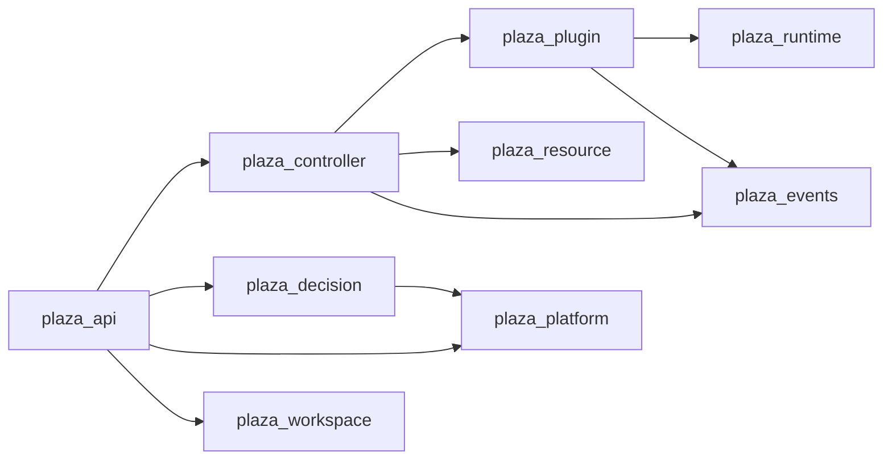

# PlazaVM v2 — Architecture Diagrams

This directory contains editable Mermaid diagram sources (`.mmd`) and SVG exports visualising PlazaVM's core subsystems.

---

## Available Diagrams

1. [Crate Dependency Graph](crate-dependency-graph.mmd) — Architectural boundaries across all 22 workspace member crates.
2. [Workspace Lifecycle](workspace-lifecycle.mmd) — State transition matrix (`Created` -> `Scheduling` -> `Running` -> `Stopping` -> `Stopped` -> `Destroyed`).
3. [Reconciliation Loop](reconciliation-loop.mmd) — Event-driven state convergence cycle.
4. [Decision Scoring Flow](decision-scoring-flow.mmd) — Intent-matching decision matrix for backend selection.
5. [Plugin Host Lifecycle](plugin-host-lifecycle.mmd) — Dynamic plugin registration, health probing, and execution dispatch.

---

## 1. Crate Dependency Graph



---

## 2. Workspace State Machine

```mermaid
stateDiagram-v2
    [*] --> Created
    Created --> Scheduling: DesiredState::Running
    Scheduling --> Running: Backend Start Succeeded
    Scheduling --> Error: Resource Exhausted / Backend Failed
    Running --> Stopping: DesiredState::Stopped
    Stopping --> Stopped: Graceful Stop Completed
    Stopped --> Scheduling: DesiredState::Running
    Stopped --> Destroyed: Delete Request
    Error --> Destroyed: Delete Request
    Destroyed --> [*]
```
