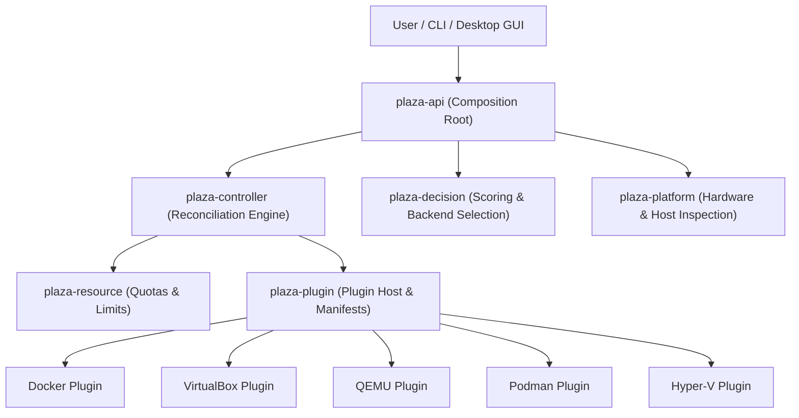

# PlazaVM v2 — Architecture Overview

PlazaVM v2 is designed as a **Universal Workspace Platform**. It abstracts execution technologies behind a single developer experience.

---

## 🏗 Architecture Principles

1. **Workspace-First Abstraction**: Users declare workloads; PlazaVM determines the optimal execution technology.
2. **Explicit Layer Boundaries**: Strict separation between Platform, Decision, Controller, Runtime, and Resource subsystems.
3. **Event-Driven Asynchrony**: Subsystems communicate asynchronously over a high-throughput Tokio event bus.
4. **Declarative Reconciliation**: State convergence loop continuously aligns current state with desired state.
5. **Dynamic Runtime Plugins**: Runtime backends (Docker, VirtualBox, QEMU, Podman, Hyper-V) are isolated plugins.

---

## 📊 Layered Subsystem Hierarchy

---

## 📦 Workspace Crate Layout (22 Member Crates)

- **Domain Core**: `plaza-core`, `plaza-events`, `plaza-config`, `plaza-storage`
- **Subsystem Logic**: `plaza-platform`, `plaza-workspace`, `plaza-controller`, `plaza-decision`, `plaza-resource`, `plaza-ai`, `plaza-monitor`, `plaza-registry`
- **Runtime Abstraction**: `plaza-runtime`, `plaza-plugin`
- **Application & UI**: `plaza-api`, `plaza-cli`, `plaza-desktop`
- **Execution Plugins**: `plugins/docker`, `plugins/virtualbox`, `plugins/qemu`, `plugins/podman`, `plugins/hyperv`
