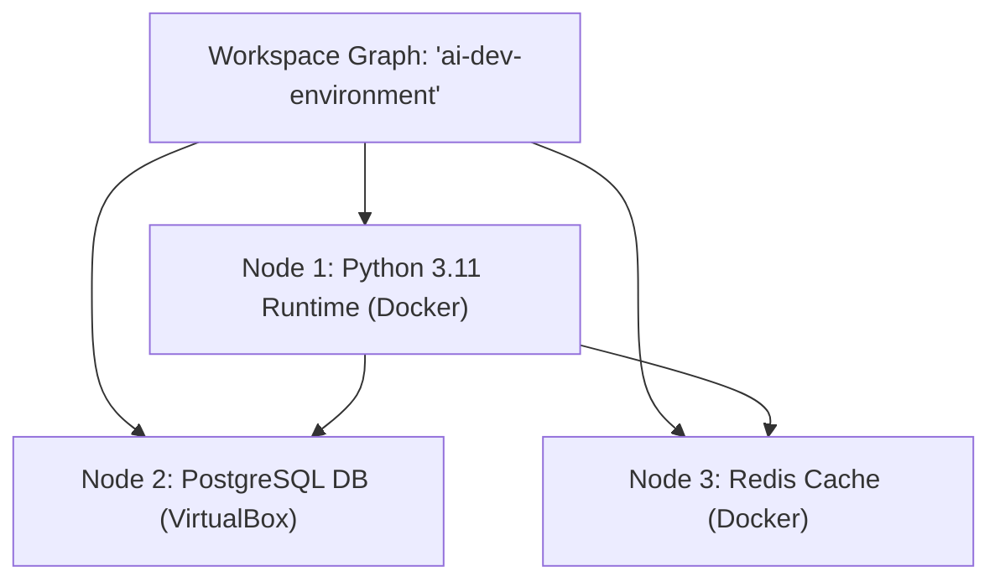

# Workspace Graph Architecture

PlazaVM v2 represents workspaces as a **Directed Acyclic Graph (DAG)** of interconnected runtime nodes.

---

## 💡 Concept

In PlazaVM, a workspace is not limited to a single container or virtual machine. A workspace represents a **complete development environment topology** containing multiple runtime nodes (e.g. Python app + PostgreSQL database + Redis cache).



---

## 📑 Declarative Node Specification

Each runtime node in the workspace graph defines its own intent, resource allocations, and dependencies:

```yaml
version: "1"
workspace:
  name: "ai-dev-environment"
nodes:
  - id: "python-app"
    kind: "container"
    image: "python:3.11-slim"
    resources:
      cpu_cores: 4
      memory_mb: 8192
  - id: "postgres-db"
    kind: "virtual_machine"
    os: "linux"
    resources:
      cpu_cores: 2
      memory_mb: 4096
```
