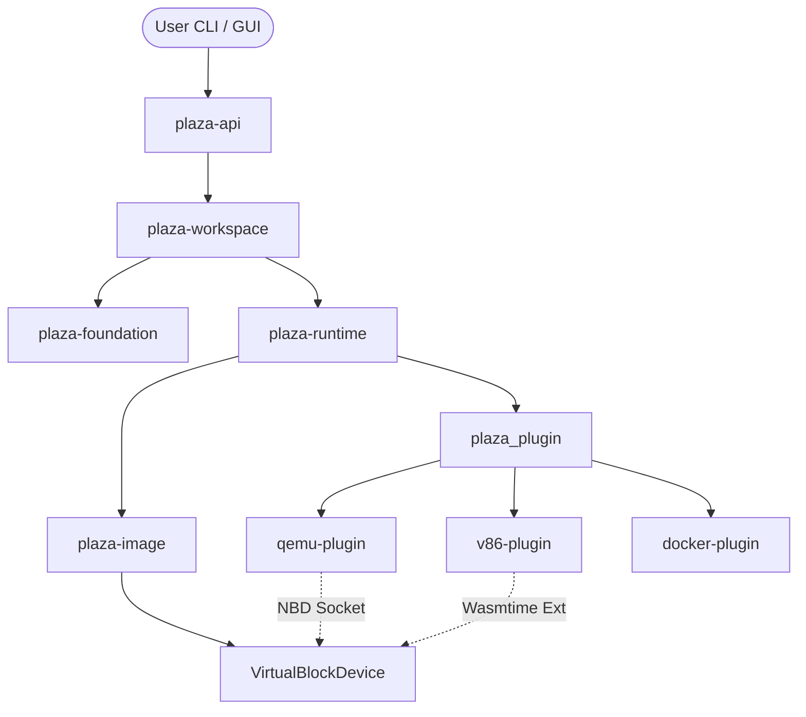

# Architecture Overview

PlazaVM is constructed as an asynchronous, event-driven orchestration engine written in Rust. It utilizes a modular, plugin-based backend to interact with different virtualization engines.

## Core Tenets

1. **Default-Deny Security**: By default, workspaces possess zero capabilities. They cannot access the host filesystem, network, clipboard, or devices. Every capability must be explicitly granted in the `plaza.yaml` configuration.
2. **Strict Abstraction Boundaries**: Plugins (e.g., QEMU, v86, Docker) do not read `plaza.yaml` or parse stringly-typed intents. They receive a strongly-typed `MachineConfig` from `plaza-runtime`, which has already evaluated capability policies.
3. **Workspace as Aggregate Root**: The `Workspace` model in `plaza-workspace` is the single source of truth for the entire system, managing state transitions and graph resolution.

## Component Graph

## Reconciliation Loop

`plaza-workspace` implements a Kubernetes-style continuous reconciliation loop (`Reconciler`). It compares the `DesiredState` declared by the user with the actual observed `WorkspaceState`, and emits lifecycle actions to transition the workspace appropriately. 
