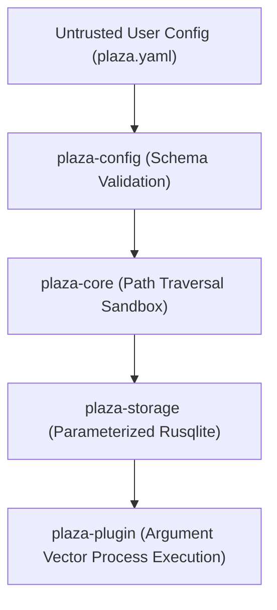

# PlazaVM v2 — Security Audit & Defense Architecture

This document summarizes the security controls, memory safety audit, and defense-in-depth architecture implemented in PlazaVM v2.

---

## 🔒 Security Baseline Findings

- **Unsafe Code Audit**: 0 `unsafe` blocks in core workspace management logic.
- **SQL Injection Shield**: 100% parameterized SQL queries via `rusqlite::params![]`.
- **Path Traversal Sandbox**: User data paths bounded strictly within `plaza_core::paths::data_dir()`.
- **Secrets Isolation**: In-memory secret store (`InMemorySecretStore`) with zero disk exposure for ephemeral tokens.
- **Sub-Process Execution Shield**: OS process spawning uses strongly typed argument vectors (`std::process::Command::args`), completely avoiding shell string interpolations.

---

## 🛡 Layered Security Architecture

